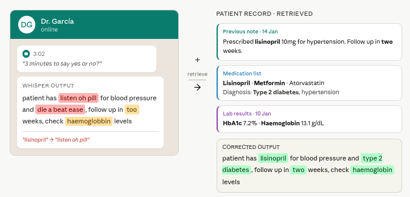

# ASR Post-Correction with Retrieval-Augmented Generation

This project investigates whether retrieving relevant text passages and feeding them to a large language model can improve the quality of automatic speech recognition transcripts — and whether that approach is safe to use in clinical settings.

The core question: when a speech recognition model mishears something, can an LLM fix it if you give it related text as context? And does that strategy hold up when the transcript contains medical terminology, where a wrong word isn't just awkward — it's potentially dangerous?

> A full research poster summarising the system, results, and key findings is available in [`poster.pdf`](poster.pdf).

---

## The problem in one image



The figure above shows the core idea. A doctor sends a voice note summarising a consultation. Whisper transcribes it but mishears domain-specific vocabulary — drug names, diagnoses, measurements — because these words are acoustically similar to common words but rare in general speech. A plain language model asked to fix the errors will paraphrase rather than correct. Retrieval-augmented correction pulls in relevant passages from the patient's own medical record — previous notes, medication lists, lab results — and uses those as context for the correction step. The patient's history contains the exact terminology needed to fill the gaps.

The danger, which this project documents, is that retrieving from a *loosely matched* clinical corpus — notes from other patients — introduces plausible-sounding but wrong entities. The model substitutes them and standard evaluation metrics do not catch it.

---


## What the project does

A speech recognition model (Whisper) transcribes audio and inevitably makes mistakes. This pipeline takes those noisy transcripts and attempts to correct them using one of three strategies:

1. **No correction** — use the raw transcript as-is (baseline)
2. **LLM-only correction** — send the transcript to a language model and ask it to fix errors
3. **Retrieval-augmented correction** — before asking the language model to fix errors, first retrieve a handful of relevant text passages and include them as context

The third approach (retrieval-augmented) is tested with two different retrieval methods and three different text sources, ranging from generic Wikipedia articles to consultation-matched clinical notes.

---

## The central finding

Retrieval helps on clean speech, but can actively harm clinical transcripts.

On clean TED talk audio, retrieving from a matched corpus of similar talks reduces word error rate by 54% compared to LLM-only correction. But on real clinical consultation audio, the same approach makes things worse — the model pulls plausible-sounding medical terms from retrieved passages and substitutes them into the transcript, producing output that looks correct but contains the wrong drug names, diagnoses, or measurements. Standard evaluation metrics (including embedding-based similarity scores) fail to detect these substitutions. Only entity-level evaluation catches them.

---

## The three test settings

**TED talks** — clean, rehearsed, single-speaker audio. Near-ideal conditions. Used to establish whether retrieval-augmented correction works at all.

**Simulated clinical dialogues (MTS-Dialog)** — 100 doctor–patient conversations with artificially injected noise (random word drops and swaps). No real audio; noise is synthetic. Tests entity preservation in medical text.

**Real clinical consultations (PriMock57)** — 57 mock primary care consultations with real audio recorded and transcribed using Whisper. The only setting with genuine, phonetically-motivated speech recognition errors. The hardest and most clinically realistic test.

---

## Retrieval methods compared

**Keyword retrieval (BM25)** — matches passages based on shared words. Fast and interpretable, but retrieves based on surface overlap, not meaning. Performs poorly when the query and relevant passages use different vocabulary.

**Dense semantic retrieval** — converts text into numerical vectors using a sentence embedding model, then finds passages with similar meaning regardless of exact wording. More robust, especially when vocabulary varies.

Each method is tested with three types of retrieval corpus: generic out-of-domain text, domain-relevant text, and text matched to the specific consultation or speaker.

---

## Table of contents

1. [Repository structure](#2-repository-structure)
2. [Metrics](#3-metrics)
3. [Experimental conditions](#4-experiments-and-conditions)
4. [Setup](#5-setup)
5. [How to run](#6-how-to-run)
6. [Results summary](#7-results-summary)
7. [Visualisations](#8-visualisations)

---

## Repository structure

```
ASR_RAG_project/
├── README.md
├── run_all.sh                    # Full pipeline: all three datasets end-to-end
├── requirements.txt
│
├── experiments/
│   ├── test/                     # TED experiments
│   ├── mts/                      # Clinical dialogue experiments
│   └── primock57_speech/         # Real clinical audio experiments
│
├── analysis/                     # Evaluation scripts
├── visualisations/               # Figure generation
├── scripts/                      # Helper scripts
│
├── results/
│   ├── ted/                      # TED outputs and metrics
│   ├── mts/                      # Clinical dialogue outputs and metrics
│   └── primock57_speech/         # Real audio outputs and metrics
│
├── images/                       # Generated figures
└── datasets/                     # Raw data loaders
```

---

## Metrics

All outputs are normalised before scoring (lowercase, punctuation removed, whitespace collapsed).

| Metric | What it measures |
|--------|-----------------|
| **Word Error Rate** | How many words were changed, inserted, or deleted vs the reference. Lower is better. |
| **BLEU** | N-gram precision against the reference. Higher is better. |
| **ROUGE-L** | Longest common subsequence between output and reference. Higher is better. |
| **BERTScore** | Semantic similarity using contextual embeddings. Higher is better. Paraphrase-tolerant — does not catch entity substitutions. |
| **Named Entity F1** | Whether the correct named entities (people, organisations, dates) appear in the output. Higher is better. |
| **Chemical F1 / Disease F1** | Whether the correct drug names and disease names appear. Clinical-domain specific. Higher is better. |

---

## Experimental conditions

### TED talks

| Condition | Description | Retrieval corpus |
|-----------|-------------|-----------------|
| C1 | Raw Whisper output | — |
| C2a | LLaMA correction, no retrieval | — |
| C2b | Mistral correction, no retrieval | — |
| C3-Lex-Gen | Keyword retrieval | Wikipedia |
| C3-Lex-Rel | Keyword retrieval | Full TED transcript corpus |
| C3-Lex-Mat | Keyword retrieval | Leave-one-speaker-out TED |
| C4-Den-Gen | Dense retrieval | Wikipedia |
| C4-Den-Mat | Dense retrieval | Leave-one-speaker-out TED |

### Clinical dialogues (simulated noise)

| Condition | Description | Retrieval corpus |
|-----------|-------------|-----------------|
| C1 | Noisy baseline | — |
| C2a | LLaMA correction, no retrieval | — |
| C2b | Mistral correction, no retrieval | — |
| C3-Lex-Gen | Keyword retrieval | News articles |
| C3-Lex-Rel | Keyword retrieval | Real clinical consultation notes |
| C3-Lex-Mat | Keyword retrieval | Leave-one-dialogue-out clinical notes |
| C4-Den-Gen | Dense retrieval | News articles |
| C4-Den-Rel | Dense retrieval | Real clinical consultation notes |
| C4-Den-Mat | Dense retrieval | Leave-one-dialogue-out clinical notes |

### Real clinical audio (PriMock57)

| Condition | Description | Retrieval corpus |
|-----------|-------------|-----------------|
| C1 | Raw Whisper output | — |
| C2a | LLaMA correction, no retrieval | — |
| C2b | Mistral correction, no retrieval | — |
| C3-Lex-Gen | Keyword retrieval | Wikipedia |
| C3-Lex-Rel | Keyword retrieval | Clinical dialogue transcripts |
| C3-Lex-Mat | Keyword retrieval | Leave-one-out consultation notes |
| C4-Den-Gen | Dense retrieval | Wikipedia |
| C4-Den-Mat | Dense retrieval | Clinical dialogue transcripts |

---

## Setup

Requires Python 3.10–3.12. Does not support Python 3.14 (dependency constraint from the entity recognition libraries).

```bash
python3.12 -m venv .venv
source .venv/bin/activate
pip install -r requirements.txt
python -m spacy download en_core_web_sm
```

Requires [Ollama](https://ollama.com) running locally with `mistral` and `llama3:8b` pulled.

**Optional — clinical entity evaluation (drug names and diseases):**
```bash
pip install scispacy
pip install https://s3-us-west-2.amazonaws.com/ai2-s2-scispacy/releases/v0.5.4/en_ner_bc5cdr_md-0.5.4.tar.gz
```

---

## How to run

**Full pipeline:**
```bash
bash run_all.sh
```

**Clinical dialogue pipeline with entity evaluation:**
```bash
bash scripts/run_full_mts_analysis_with_scispacy.sh
```

**Figures only:**
```bash
bash scripts/run_visualisations.sh
```

**Individual steps:**

| Step | Command |
|------|---------|
| Prepare real audio data | `python -m analysis.prepare_primock57` |
| Transcribe real audio | `python -m experiments.primock57_speech.c1_whisper` |
| Run retrieval-augmented correction on real audio | `python -m experiments.primock57_speech.run_rag` |
| Evaluate real audio results | `python -m analysis.primock57_speech_eval` |
| Evaluate clinical dialogues | `python -m analysis.mts_eval` |
| Statistical significance tests | `python -m analysis.wilcoxon_mts` |

---

## Results summary

### TED talks (10 speakers)

| Condition | Word Error Rate | BLEU | ROUGE-L | BERTScore |
|-----------|----------------|------|---------|-----------|
| Raw Whisper | 0.079 | 0.866 | 0.943 | 0.974 |
| Mistral only | 0.305 | 0.592 | 0.790 | 0.935 |
| Dense matched retrieval | **0.140** | **0.807** | **0.909** | **0.959** |

Dense matched retrieval significantly outperforms LLM-only correction (p < 0.01). Generic keyword retrieval is the worst corrected condition.

### Clinical dialogues (100 dialogues)

| Condition | Word Error Rate | BLEU | Chemical F1 | Disease F1 |
|-----------|----------------|------|-------------|------------|
| Noisy baseline | **0.157** | **0.694** | **0.918** | **0.922** |
| Mistral only | 0.241 | 0.658 | 0.933 | 0.935 |
| Dense matched retrieval | 10.25* | 0.513 | 0.890 | 0.837 |

*Word error rate inflated by output verbosity. Clinical matched retrieval significantly degrades disease entity preservation vs LLM-only (p = 0.0013).

### Real clinical audio (10 consultations)

| Condition | Mean Word Error Rate |
|-----------|---------------------|
| Mistral only | **0.869** |
| Dense matched retrieval | 0.991 |

LLM-only correction outperforms retrieval-augmented correction on real clinical speech. Phonetically-motivated errors in real audio cannot be recovered from text context alone.

---

## Visualisations

| Script | Output | What it shows |
|--------|--------|--------------|
| `ted_summary.py` | `ted_cond_metrics.png` | All four metrics across conditions for TED |
| `ted_wer_heat.py` | `ted_wer_heat.png` | Per-speaker word error rate heatmap |
| `improvement_chart.py` | `improvement_chart.png` | Word error rate change relative to LLM-only baseline |
| `retrieval_luck.py` | `retrieval_luck.png` | Per-speaker variability showing keyword retrieval is inconsistent |
| `mts_summary.py` | `mts_cond_metrics.png` | Clinical dialogue metrics including entity scores |
| `ner_bert_divergence.py` | `ner_bert_divergence.png` | The gap between semantic similarity and entity preservation on clinical text |
| `primock57_speech_summary.py` | `primock57_speech_cond_metrics.png` | Real audio results across all conditions |
